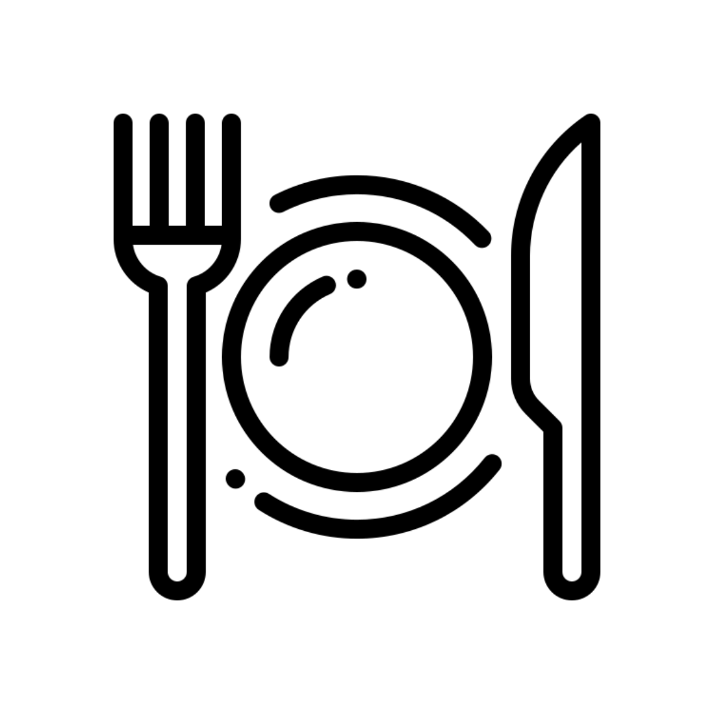
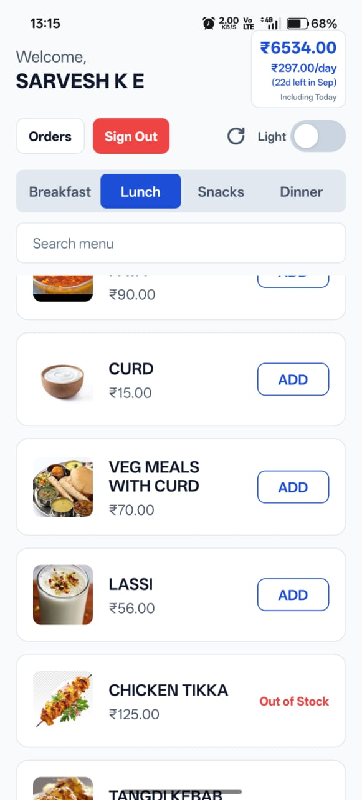
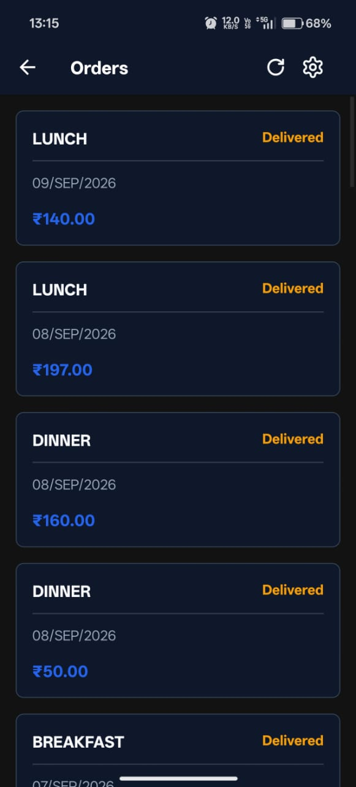

  
  <h1>FoodParkCC</h1>
  
A fast, modern, and private third-party client tailored for VIT Chennai's Proodle Foodpark.

  
  &nbsp;&nbsp;
  

 **Android Users**: It is highly recommended to download the APK for the best offline experience and performance.  
 **iOS Users**: Open the [website](http://foodparkcc.pages.dev/) in Safari, tap the **Share** icon, and select **"Add to Home Screen"** to install the app.

## Screenshots

  
  &nbsp;&nbsp;&nbsp;&nbsp;&nbsp;&nbsp;
  

FoodParkCC is an unofficial alternative client that provides a clean, modern interface for the campus food ordering system. It is built to offer a straightforward and fast way to browse menus, place orders, and manage your wallet balance. 

## Features

- **Persistent Sessions**: Log in just once and stay logged in. FoodParkCC securely manages and retains your active session entirely on your local device, completely eliminating the repetitive hassle of entering your Login ID and PIN every time you want to order food.
- **Low-Connectivity & Offline Resilience**: Built to handle spotty campus networks gracefully. If you have poor internet or drop offline completely, the app caches your data so you can still instantly check your current wallet balance and pull up past order QR codes without waiting for a loading screen.
- **Smart QR Brightness**: Never hold up the queue at the checkout counter again. The moment you tap on an order's QR code, the app automatically maximizes your screen brightness for instant scanner recognition, and seamlessly restores your original brightness when you close it.
- **Daily Limit Tracking**: Keep a clear view of your spending. The home screen features a convenient tracker that calculates and displays exactly how much of your daily expenditure allowance you have remaining, updating instantly as you build your cart.

## Privacy First

FoodParkCC is built with a strong focus on data privacy and security.

- **No Server Storage**: Your Login ID and PIN are never stored on any external database. All sensitive data is saved securely and strictly on your local device.
- **Direct Communication**: Network requests are proxied directly to the official campus servers. We do not intercept, read, or log your passwords or transaction data.
- **Minimal Analytics**: We use PostHog strictly for basic, anonymized performance analysis to help ensure the app runs smoothly and without tracking personal data.

## Disclaimer

This is an independent, unofficial third-party client and is not affiliated with, endorsed by, or supported by Proodle or VIT Chennai.

Please note that this application interfaces with external systems outside of our control. Since it relies on third-party architecture, we cannot guarantee uninterrupted functionality or absolute accuracy, and experiences may vary depending on official backend updates.

## License

This project is open-sourced under the MIT License. See the `LICENSE` file for details.
